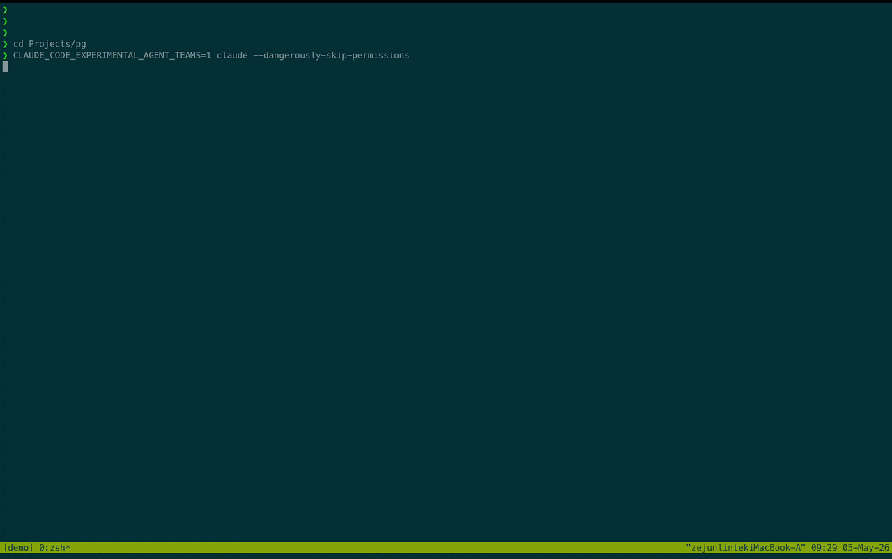

<div align="center">

# 🦸 Superteam

### 都有 AI 了，咋还天天搁这儿人肉盯盘呢？

**敲个 `/superteam`，直接在后台拉起一个正儿八经的工程团队。陪你把需求盘明白，锁死验收条件，<br/>然后通宵死磕你们公司的业务组件（Flyte、HDFS、k8s、内部镜像源、各种 MCP server）。<br/>一小步一小步往前拱，跑到所有验收脚本全绿为止。<br/>不是那种跑两步就死循环的玩具 Agent <br/>不搞"看起来跑通了其实全是 mock"的糊弄学<br/>也不用你每周一重新教它怎么连你们组的内网**

[](LICENSE)
[](https://github.com/anthropics/claude-code)
[](#tmux-后台挂机流)

**[核心能力](#核心痛点解决)** · **[快速跑通](#快速跑通)** · **[工作原理](#工作原理)** · **[后台挂机](#tmux-后台挂机流)** · **[相关项目](#相关项目)** · **[全局 Wiki](#全局-wiki-与热启动)**

**语言 / Language:** [English](README.md) · [中文](README.zh.md)

**博客：** [English](https://crysple.github.io/superteam/index.html) · [中文](https://crysple.github.io/superteam/index.zh.html)


</div>

---

## 核心痛点解决

现有 AI 工具的能力边界，往往死死卡在模型本身的边界上。下一个产品高地其实是包裹在模型外围的基础设施：工程韧性、故障恢复、长时记忆、调度编排和终态校验。一个单体 Agent 解决不了复杂链路，Superteam 就是冲着这个来的：

### 🤝 需求不对齐，坚决不写代码 (真 PM 级脑暴)
别信那种听你说了两句就回"懂了这就去写"的废话。这里的 PM Agent 会先扫一遍你的代码库，针对边界 case、依赖项和对接方提出极其具体的拷问。不把需求 bit 级对齐，它不会进入开发环节。少在跑到第 14 个小时的时候来一句"原来 AI 的假设跟我想的完全不一样"。

### 🔒 铁血验收网关 (没得商量的那种)
交付标准不是形容词，而是跑得通的 shell 脚本——`pytest`、`ssh edge-01 'hdfs dfs -test ...'`、`flytectl ... | jq -e '.phase=="SUCCEEDED"'`。动工前你先 review 验收脚本，脚本过不了，退出码不为 0，就是没做完。LLM 考官容易被忽悠，但硬核的 exit code 不会。

### 🌙 甩手掌柜模式 (晚上下发，早上收 PR)
Claude Code 单机跑个 20 分钟上下文基本就漂移了。Superteam 能连轴转 20 个小时以上：每一个拆解的小任务都会拉起一对全新的 Generator / Evaluator。Evaluator 瞎了眼也看不到 Generator 的心路历程——机制上强制对抗。没有上下文污染，再配合远程机挂 [tmux](#tmux-后台挂机流)，你睡觉，它干活。

### 🛟 链路自愈，死不掉的流水线
所有 Agent 都是跑在自己独立 tmux pane 里的真实 Claude Code 会话，不是什么内存里的子线程。状态全落盘 (`state.json`，`events.jsonl`)：
- **1200秒看门狗**：主控进程卡死？直接从磁盘状态拉起重试。
- **5级熔断升级**：遇到刺头 Bug 绝对不死磕。重试 → 换思路 → 重置上下文 → 拆解需求 → 实在不行再抛出来问你。
- **终态强校验**：全部搞定后，拉个全新的 Evaluator 把验收网关从头跑一遍。

### 🧠 基建环境，只教一次
内部 CLI 怎么敲？测试环境怎么连？哪台机器要跳板机？
每次成功交付后，Curator 会把这些血泪踩坑经验过滤一遍，有复用价值的直接沉淀到 `~/.superteam/` 全局 wiki 里。新需求开荒时，Explorer 会优先从 wiki 倒排加载上下文。到第 5 个需求时，你们团队那一套奇葩的内部规矩，它比新来的应届生还熟。

---

## 快速跑通

### 1. 怎么装
在 Claude Code 里直接把咱们的 repo 加到 marketplace 里：
```
/plugin marketplace add Crysple/superteam
/plugin install superteam@superteam
/reload-plugins
```
*依赖 Claude Code v2.1.32+，记得开 agent teams 特性。建议在 tmux 里跑，这样每个 Agent 独占一个 pane。*

```bash
export CLAUDE_CODE_EXPERIMENTAL_AGENT_TEAMS=1
tmux new-session -s superteam
claude --teammate-mode tmux
```

### 2. 扔个真实需求给它
普通 Agent 遇到 `command not found`、找不着 CUDA 或者内部鉴权不通过就直接摆烂了，这种活儿最适合 Superteam：
```text
/superteam 拿最近 7 天的曝光日志跑个 CTR 排序模型，通过 `pyflyte run --remote` 提给 H100 集群，
目标 AUC ≥ 0.78，跑完把产物打上 v3 tag 发到内部模型仓库。
```

### 3. 跟 PM 扯皮（脑暴阶段）
PM 会根据你们的内部 wiki 和当前代码库，把你问到没有死角：
```text
PM: 曝光日志（impression-logs）Hive 分区是每天 02:00 UTC 产出。"最近 7 天"是指今天往前推 7 天，还是 7 个完整的天级分区？建议后者，免得跑出一半的数据。
PM: AUC ≥ 0.78 —— 拿线上模型那套相同的验证集跑，还是切个新的 holdout？如果切新的，我得先去拉数据组的脚本把 split 锁死。
PM: 你们模型仓库走 semver，标 v3 算大版本更新了。serving 的配置要跟着动吗？架构跟现在 2.x 的服务还兼容吗？如果不兼容，发版前我得加个向下兼容的测试网关。
```

### 4. Review 验收网关
没问题了，PM 会吐出具体的验收脚本（全是大实话，没有废话）：
```text
Final Acceptance Gates
─────────────────────────────────────────────────────────────────────────────
  gate-01-data.sh       最近 7 天的 Hive 分区必须存在
                        → hdfs dfs -test -d /data/impressions/dt={d-7..d-1}/_SUCCESS
  gate-02-submit.sh     pyflyte 提交成功并拿到 ${EXEC_ID}
                        → flytectl get execution ${EXEC_ID} --details
  gate-03-train.sh      任务跑完，状态是 SUCCEEDED
                        → flytectl get execution ${EXEC_ID} -o json | jq -e '.phase=="SUCCEEDED"'
  gate-04-auc.sh        拿锁死的 v2 holdout 跑，AUC 达标
                        → python eval.py --split locked-holdout-2026-Q1 | jq -e '.auc>=0.78'
  gate-05-registry.sh   v3 镜像推送成功，签名和 ready 状态正常
                        → registry-cli get ctr-ranker:v3 | jq -e '.signed and .ready'
─────────────────────────────────────────────────────────────────────────────
你 approve 这套标准吗？(yes / no / revise)
```

### 5. Approve，然后去睡觉
```
> yes
```
完事。Architect 把 spec 拆成一个个带合约的增量，Generator/Evaluator 配对实现并验收每个增量，最后 Strict Evaluator 对着完整交付物把所有验收脚本跑一遍。跑完通知你，遇到真正卡死的权限/访问问题才会打扰你。

### 更多可以试的 prompt
上面这个 CTR 模型只是一种典型场景。再来四个普通 Agent 会卡死、Superteam 能扛住的企业场景——另加一个纯本地热身案例：
```bash
# Spark + Airflow 数据管道，真实落盘（HDFS 有防火墙，edge node 上跑 kerberos）
/superteam 加一个每日 PySpark 作业：把 /data/prod/events 和 feature_flags 表 join，分区写到 /out/daily/features/，在 Airflow 里配 retry，SLA 超时报警到 #data-oncall。

# 对接内部栈新建 gRPC 接口（私有包镜像，多语言 stub）
/superteam 在 payment-service 里加 POST /v2/payments，带幂等键，从公司镜像拉 acme-auth==2.4.*，重新生成 Python + Java proto stub，更新 OpenAPI 文档。

# 能在生产扛住的 Kafka 消费者（DLQ、broker 重启、内网鉴权）
/superteam Kafka 消费者接 user-events，10k/s 吞吐，写内部 Postgres（ldap 鉴权），打 DataDog 指标，毒消息路由到 user-events-dlq，broker 重启零丢失。

# 带 SLO 门槛和自动回滚的灰度发布（真实生产操作，不用人盯）
/superteam 把 user-search 从 EC2 迁到 k8s。P99 ≤ 80ms，走 canary flag 滚动，盯 Datadog 面板 1 小时，错误率 > 0.5% 自动回滚。

# 热身——纯本机跑（不需要集群，适合第一次试）
/superteam 搭一个带限流和死信队列的 Redis 任务队列。
```

这几个企业场景的验收脚本都没法在本地糊弄——`hdfs dfs -test`、`pip install --index-url`、`kafka-consumer-groups --describe`、`kubectl rollout status && datadog-cli monitor get`。**从这里开始，"完成"不再是一种感觉。**

---

## tmux 后台挂机流
因为 Superteam 底层走的是 Claude Code 的 team 模式，每个 Agent 都在独立的 tmux pane 里。这就带来一个极度舒适的特性：
**关掉电脑，随它跑。网络断了也不慌，重新连回服务器，现场全在。**

```bash
# 找台吃灰的开发机连上去
ssh you@vm.dev
tmux new-session -s superteam
claude
> /superteam Build a rate-limited job queue with Redis and DLQ support
# 对齐需求，approve 网关后...
# 直接 Ctrl-b d 切出去。合上电脑，回家睡觉。

# 第二天早上随便找台电脑连回去
ssh you@vm.dev
tmux attach-session -t superteam
# 看看看门狗有没有叫，或者直接看状态日志：
tail -f .superteam/state.json
```

万一某个 pane 崩了，看门狗会读 `.superteam/state.json` 自动从断点拉起。**历史记录全在文件里，这就是系统韧性的兜底。**

**各组件分工：**
| 组件 | 24/7 运行靠它做了什么 |
|------|----------------------|
| **Claude Code team 模式** | 每个成员都是独立的 Claude Code 会话，各占一个 tmux pane——故障隔离，重启精准，上下文不跨角色串。 |
| **远程 VM + tmux** | 会话生命周期独立于你的笔记本、Wi-Fi 和睡眠时间。随时 SSH 回来，团队原地不动。 |
| **`.superteam/state.json`** | 某个 pane 挂了，看门狗从磁盘状态重新拉起。历史就是文件。 |
| **看门狗（1200 秒）** | 检测流水线卡死，自动重启 Orchestrator，完整上下文保留。不用你去盯着它。 |
| **每增量全新配对** | 长时间运行不退化——每对 Generator/Evaluator 从零上下文启动。 |

**恢复排查清单**（SSH 进去发现有问题的时候）：
1. `tmux attach-session -t superteam`——总览所有 pane。
2. `jq '.' .superteam/state.json | head -40`——当前阶段、活跃 Agent、看门狗卡死计数。
3. `tail -50 .superteam/events.jsonl`——最近的决策、异常、上报。
4. 如果 Orchestrator pane 消失了：看门狗 20 分钟内会重新拉起。或者手动重启——新实例会读 `state.json`，从记录的 `phase_step` 续跑。

---

## 接入公司知识库（可选 MCP 配置）
团队的上限取决于能搜到什么。Explorer 开箱就认识你的代码库。把公司的 MCP server 挂上来——Glean、Sourcegraph、Confluence、Linear、Slack、组织架构——它就认识你们公司了：内部 CLI、包镜像、近期决策、该问谁。

在 Claude Code 里注册（`/mcp`），再列到 [`global-guide.md`](#全局指引) 里。Explorer 遇到不认识的内部术语时会去查，Curator 在会话结束时把答案提升到 `~/.superteam/`。**今天的 MCP 查询，就是明天 wiki 里的条目，就是下周的肌肉记忆。**

---

## 相关项目
插件本身刻意保持轻量（无 API、无云、无额外进程——纯 Claude Code）。这些项目和它配合得不错：

### [free-claude-code](https://github.com/Alishahryar1/free-claude-code) — 把 Claude Code 接到免费/便宜/本地模型
这是一个 Claude Code Anthropic Messages API 的直插代理，把流量转发到 NVIDIA NIM、OpenRouter、DeepSeek、LM Studio、llama.cpp 或 Ollama。让你用免费托管模型或纯本地硬件跑 Superteam 的通宵循环，支持按层路由（Opus/Sonnet/Haiku 分别对应不同 provider），还有可选的 Discord/Telegram bot 让你在手机上戳运行中的任务。
```bash
# 配合 Superteam：把 Claude Code 指向代理，然后照常跑 /superteam
ANTHROPIC_AUTH_TOKEN="freecc" ANTHROPIC_BASE_URL="http://localhost:8082" claude
> /superteam …
```
> 跑 20 小时通宵任务但不想付 20 小时 Anthropic 账单的时候用。

*(更多配套项目持续补充——欢迎 PR。)*

---

## 工作原理

### 执行流水线
你 approve spec 之后，五个阶段全自动跑：
```
┌─────────────────────────┐
│  阶段一 · PM            │  ← 你在这里参与
│  脑暴 + 验收网关        │
└────────────┬────────────┘
             │ 你 approve
┌────────────▼────────────┐
│  阶段二 · Architect     │  从这里全自动
│  拆方案 + 写合约        │
└────────────┬────────────┘
             │
┌────────────▼────────────┐
│  阶段三 · 执行          │
│  Generator ↔ Evaluator  │
│  （每增量全新配对）     │
└────────────┬────────────┘
             │
┌────────────▼────────────┐
│  阶段四 · 严格评估      │  FAIL → 定向修复增量 → 阶段三
│  所有验收网关           │  最多 3 次重跑，之后上报你
└────────────┬────────────┘
             │ PASS
┌────────────▼────────────┐
│  阶段五 · 交付          │
│  Curator + 结果         │
└─────────────────────────┘
```
**阶段一（PM）**——PM 通过 Explorer 扫描代码库，提出分类问题，产出带可量化验收标准的 spec。你 review 并 approve，之后才会动工。

**阶段二（Architect）**——把 spec 拆成若干增量，每个增量对应一份冻结合约（前置条件、硬验收脚本、软验收项、不变量）。Generator 负责编写并测试验收脚本。

**阶段三（执行）**——Manager 驱动并行执行循环。每个增量分配全新的 Generator/Evaluator 配对，直接对着冻结合约迭代，直到 APPROVED。Manager 全程监控异常。

**阶段四（严格评估）**——全新的 Strict Evaluator 对着完整交付物把所有最终验收网关跑一遍。二元结果：PASS 或 FAIL。FAIL 时，Architect 写出定向修复增量，阶段三重跑（最多 3 次循环）。

**阶段五（交付）**——Curator 把可复用知识提取到全局 wiki（`~/.superteam/`），输出结果。

---

### Generator ↔ Evaluator 循环
核心质量机制：两个全新 Agent，一份冻结合约，对抗性反馈。
```
┌──────────────────────────────────────┐
│  冻结合约（只读）                    │
│  前置条件 · 硬验收脚本              │
│  软验收项 · 不变量                  │
└────────┬──────────────────┬──────────┘
         │                  │
┌────────▼───────┐   ┌──────▼──────────┐
│   Generator    │──▶│   Evaluator     │
│   实现         │   │   跑验收脚本    │
│   提交         │◀──│   给出判断      │
└────────────────┘   └──────┬──────────┘
     修改 + 反馈             │ APPROVED
                             ▼
                    该增量完成 ✓
```
Evaluator 只能看合约和 Generator 的输出，看不到 Generator 的推理过程。这从机制上防止了 Evaluator 的锚定效应。

---

### 四层合约校验
每个增量在实现开始前先写好冻结合约，然后对着它验收：
| 层级 | 内容 | 成本 |
|------|------|------|
| **前置条件** | 开工前必须通过的脚本 | 0 LLM token |
| **硬验收脚本** | 确定性脚本——二元通过/失败 | 0 LLM token |
| **软验收项** | 有据可查的 LLM review（尽量少用） | 低 |
| **不变量** | 通用质量基线——hook 强制，始终运行 | 0 LLM token |

硬验收脚本是主要机制。软验收项仅在确实需要人类判断的地方补充。

---

### 团队成员一览
| 成员 | 生命周期 | 职责 |
|------|----------|------|
| **Team Lead (TL)** | 常驻 | 唯一对用户的接口。负责 spawn Agent、把关 approve、跑看门狗。 |
| **Orchestrator** | 常驻 | 驱动阶段切换，持有 `state.json`，处理 GATE-CHALLENGE、inability 和重启循环。 |
| **PM** | 阶段一 | 与用户脑暴 spec，生成验收网关。 |
| **Explorer** | 常驻 | 扫描代码库，初始化知识库，派遣研究子 Agent。 |
| **Architect** | 常驻 | 把 spec 拆成合约，GATE-CHALLENGE 时修复验收脚本。 |
| **Manager** | 阶段三~五 | 无状态监控循环（270 秒），检测异常，驱动执行循环。 |
| **Curator** | 阶段五 | 会话结束时提取知识到全局 wiki。 |
| **Generator** | 每增量全新 | 读冻结合约 → 实现 → 预验证 → 提交 → 申请 review。 |
| **Evaluator** | 每增量全新 | 只读合约 + 输出 → 四层校验 → 给出判决。 |

---

### 五级熔断升级
增量卡死时，Manager 逐级升级——每一级都换思路，不是无脑重试：
```
检测到卡死
    │
    ▼ 第一击 —— 带反馈重试（Gen/Eval 循环）
    ▼ 第二击 —— Manager 提示：换个思路
    ▼ 第三击 —— 上下文重置：杀掉配对，拉起全新一对
    ▼ 第四击 —— 范围调整：Architect 把增量再拆细
    ▼ 第五击 —— 询问用户（仅限鉴权/访问类拦截）
```

---

### 状态架构
三个追加安全的文件协调整个团队。Manager 每个周期从头重读它们，不存积累上下文。**历史就是文件。**
```
.superteam/
├── state.json                  CAS 保护的协调状态
│                               阶段、活跃 Agent、循环计数器
│                               只能通过 scripts/state-mutate.sh 修改
│
├── events.jsonl                追加专用事件流
│                               决策 · 异常 · 状态变更 · 上报
│
└── strict-evaluations.jsonl    阶段四判决日志
                                每个循环幂等 · FAIL 计数控制重启上限
```

---

## 全局 Wiki 与热启动
> 参考 Andrej Karpathy 的 [LLM Wiki 模式](https://gist.github.com/karpathy/442a6bf555914893e9891c11519de94f)——用 LLM 维护一个持续累积的知识库，而不是每次会话重新推导相同的结论。

### 两层知识结构
```
~/.superteam/           ← 全局 wiki（跨所有项目共享）
  index.md              ← 入口：实体页、概念页、交叉引用
  knowledge/            ← 按主题划分的单独 wiki 页
.superteam/             ← 本地 wiki（仅限本项目）
  knowledge/
    index.md            ← 本地入口
    …                   ← 项目特有发现
```
**本地 wiki**（`.superteam/knowledge/`）——项目特有的发现：架构怪癖、没有文档的 API、集成踩坑、测试 fixture 套路、团队约定。由 Explorer 在会话开始时初始化，整个会话中各 Agent 持续补充。

**全局 wiki**（`~/.superteam/`）——跨项目通用的常青知识：公司级模式、框架洞察、工具链怪癖、可复用验收脚本、团队约定。每次会话结束时，Curator 把有价值的本地发现提升到全局 wiki。

### 热启动
每次会话开始、扫描代码库之前，Explorer 先检查 `~/.superteam/index.md` 里有没有缓存的全局知识。如果有相关页面，先加载，代码库扫描只填空白。随着时间推移，每次新会话开始时 Agent 都带着有效上下文，不再是白板。

第一次在新项目里跑是冷启动。之后每次都更暖。在关联项目跑过几次后，Explorer 启动时就已经熟悉你们的技术栈、工具链和约定了。

### 什么会复利增长
| 提升到全局 wiki 的内容 | 示例 |
|-----------------------|------|
| 跨项目约定 | "所有服务用 `x-request-id` 做分布式追踪" |
| 工具链怪癖 | "内部构建 CLI `xyz build` 在 CI 里必须加 `--no-cache`" |
| 可复用验收脚本 | 一个验证 Redis 可用性的工作脚本 |
| 框架特有模式 | "这里的 React 组件始终把测试放在组件旁边" |
| 血泪调试经验 | "Docker Compose 启动前必须预先分配 5432 端口" |

---

## 全局指引
`global-guide.md` 文件在每次会话的每个 Agent prompt 里都会预加载。适合放需要始终存在的知识——工具、约定、公司背景。

### 针对自己团队定制
打开 `global-guide.md`，更新这几节：

**工具**——把公司特有的 MCP server 或搜索工具加在这里。这是最值得定制的一节：Agent 会用你注册的工具，但只能用你告诉它的。示例：
```markdown
## Tools
Use the **internal-search** MCP when you encounter unfamiliar internal terms,
acronyms, or need context not in the codebase. Sub-tools available:
- `internal-search.semantic`  — company-wide doc/code/people search
- `internal-search.design`    — RFCs, architecture docs, meeting notes
- `internal-search.chat`      — Slack discussions and decisions
- `internal-search.tickets`   — Jira/Linear epics and sprint context
- `internal-search.code`      — cross-repo code search (e.g. Sourcegraph)
```
> 如果公司有特定代码搜索工具（Sourcegraph、Grep.app 或内部 MCP），在这里注册。Agent 遇到不认识的符号、API 或缩写时会去查——大幅减少内部代码库里的幻觉。

**公司知识**——把占位内容替换成 Agent 在这个代码库里会遇到的内部系统、CLI、平台和术语。Explorer 会自动把本地 wiki 里有价值的发现提升到全局 wiki，但你已经知道的部分可以直接写进去。

**通用规则**——三条默认规则（动手前先想清楚、简单优先、精准改动）普遍适用。在这里加项目特有的不变量——例如"不得在没有迁移路径的情况下修改公共 API 接口"。

---

## 安装
在 Claude Code 里（推荐——任何机器都能用，包括远程 VM）：
```
/plugin marketplace add Crysple/superteam
/plugin install superteam@superteam
/reload-plugins
```
如果要在本地开发插件本身，把 repo clone 到任意位置，然后作为本地 marketplace 添加：
```bash
git clone https://github.com/Crysple/superteam ~/code/superteam
```
然后在 Claude Code 里：
```
/plugin marketplace add ~/code/superteam
/plugin install superteam@superteam
/reload-plugins
```
无论哪种方式，Claude Code 都会把插件复制到版本化缓存 `~/.claude/plugins/cache`。不要直接 `cp` 或 `git clone` 到那个路径——它由插件系统管理。范围、更新和 `/plugin` UI 用法见[官方安装文档](https://code.claude.com/docs/en/discover-plugins)。

---

## 设计哲学

来自 [`docs/Design.md`](docs/Design.md) 的十条原则：
1. **生成与评估分离**——自评必然偏宽松
2. **上下文是最稀缺的资源**——渐进式披露，不是一次性塞满
3. **设计环境，不只是 prompt**——加工具和结构，不是加更多文字
4. **增量式、独立可验证的工作单元**——合约在动工前定义"完成"
5. **每单元全新 freshness**——spawn 全新配对；替换，不压缩
6. **文件 artifact 作为唯一事实来源**——状态在上下文重置后依然存活
7. **主动验证，而非被动 review**——跑测试，不只是读代码
8. **把专家知识固化为系统规则**——把高级 review 编进验收脚本
9. **自我演化的系统**——Curator 把会话发现提升到全局 wiki
10. **先探索再规划，先规划再动工**——基于证据的 spec 和方案

---

## 项目结构

```
superteam/
├── skills/superteam/
│   ├── SKILL.md              入口点（/superteam 触发）
│   └── phases/               各阶段编排指引
├── agents/
│   ├── orchestrator.md       流水线驱动
│   ├── architect.md          合约作者
│   ├── manager.md            无状态执行监控
│   ├── explorer.md           代码库研究员
│   ├── pm.md                 产品经理
│   ├── curator.md            知识提取器
│   └── plan-evaluator.md     方案 review
├── task-forms/
│   └── engineering/
│       ├── FORM.md           表单定义
│       ├── generator.md      内循环实现者
│       └── evaluator.md      内循环验收者
├── scripts/                  基础原语（state-mutate、record-event、run-gates……）
├── hooks/                    hook 定义（verdict-gate、completion-nudge……）
├── docs/
│   ├── Design.md             哲学与原则
│   └── SCHEMA.md             状态 artifact schema
├── global-guide.md           注入每个成员 prompt 的共享规则
└── tests/                    shell 基础的 harness 测试
```
